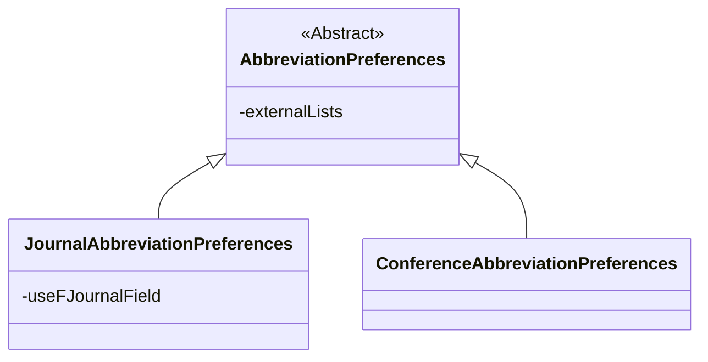
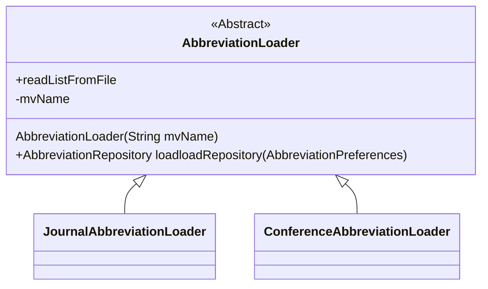

# Report for assignment 4

## Project

Name: JabRef Bibliography Management

URL: [github.com/JabRef/jabref](https://github.com/JabRef/jabref)

JabRef is an open-source, cross-platform citation and reference management tool.
JabRef helps you to collect and organize sources, find the paper you need and discover the latest research.

## Onboarding experience

Did you choose a new project or continue on the previous one?
**We choose a new project**

If you changed the project, how did your experience differ from before?

For our groups sole Windows user, Sofia, the experience differed a lot. When cloning from GitHub on Windows there are several errors like this: `error: unable to create file jablib/src/main/java/org/jabref/logic/importer/fetcher/transformers/CollectionOfComputerScienceBibliographiesQueryTransformer.java: Filename too long` due to filenames being too long. This is due to Git on Windows being compiled with msys which has a filename limit of 260 characters for a filename (for Git the limit is 4096 characters). The solution is to add [longpaths = true](https://stackoverflow.com/a/74289583) to the Git configuration. A relatively easy fix, but there is no mention anywhere in the original repo or FAQ about this problem, which should be an issue for every Windows user who tries to clone the repository.

Another thing is that JabRef has very particular requirements for [which IDE to use](https://devdocs.jabref.org/getting-into-the-code/guidelines-for-setting-up-a-local-workspace/).
> We highly encourage using IntelliJ IDEA, as it provides the most reliable experience for this project. Other IDEs may have compatibility issues, particularly Visual Studio Code.
> We do not recommend using VS Code, because it does not offer all important features essential for JabRef development.


## Effort spent

For each team member, how much time was spent in

|                                               | Olivia | Laasya | Gabriel | Daniel | Sofia  |
| --------------------------------------------- | :----: | :----: | :-----: | :----: | :----: |
| plenary discussions/meetings                  |        |        |         |        |        |
| discussions within parts of the group         |        |        |         |        |        |
| reading documentation                         |        |        |         |        |        |
| configuration and setup                       |        |        |         |        |        |
| &nbsp;&nbsp;&#8594; Git clone (Windows)       |        |        |         |        | 50 min |
| &nbsp;&nbsp;&#8594; IntelliJ (install/learn)  |        |        |         |        | 40 min |
| &nbsp;&nbsp;&#8594; Follow setup instructions |        |        |         |        |        |
| &nbsp;&nbsp;&#8594; **AddDependency**         |        |        |         |        |        |
| &nbsp;&nbsp;&#8594; **AddDependency**         |        |        |         |        |        |
| analyzing code/output                         |        |        |         |        |        |
| writing documentation                         |        |        |         |        | 20 min |
| writing code                                  |        |        |         |        |        |
| running code                                  |        |        |         |        |        |

For setting up tools and libraries (step 4), enumerate all dependencies
you took care of and where you spent your time, if that time exceeds
30 minutes.

## Overview of issue(s) and work done

Title: Make abbreviations also working for conferences #12728

URL: [github.com/JabRef/jabref/issues/12728](https://github.com/JabRef/jabref/issues/12728)

Abbreviations are listed at [github.com/JabRef/abbrv.jabref.org](https://github.com/JabRef/abbrv.jabref.org).
The system is currently not used for conference proceedings (field booktitle)

Scope (functionality and code affected).

## Requirements for the new feature or requirements affected by functionality being refactored

The following requirements are based on the issue description. Note that tests are implemented at first to be used as a validation tool of all other requirements, as required by the assignment instructions `Part 2: Issue Resolution, 2-3`. The order of all other requirements are based on the order they are mentioned in the [issue thread](https://github.com/JabRef/jabref/issues/12728).

**[req 1](https://github.com/JabRef/jabref/issues/12728#issuecomment-2720749311)**

Before shortening:
```bibtex
@inproceedings{DBLP:conf/bpm/Rinderle-MaM21,
  author    = {Stefanie Rinderle{-}Ma and
               Juergen Mangler},
  title     = {Process Automation and Process Mining in Manufacturing},
  booktitle = {International Conference on Business Process Management},
  series    = {Lecture Notes in Computer Science},
  volume    = {12875},
  pages     = {3--14},
  publisher = {Springer},
  year      = {2021}
}
```
After shortening:
```bibtex
@inproceedings{DBLP:conf/bpm/Rinderle-MaM21,
  author    = {Stefanie Rinderle{-}Ma and
               Juergen Mangler},
  title     = {Process Automation and Process Mining in Manufacturing},
  booktitle = {BPM},
  series    = {Lecture Notes in Computer Science},
  volume    = {12875},
  pages     = {3--14},
  publisher = {Springer},
  year      = {2021}
}
```
There will be a CSV file:
International Conference on Business Process Management,BPM

**Test**
Test by using the input above and asserting that the output is correct.
- `abbreviateBookTitleField()` in `AbbreviateBookTitleField()`
- `unabbreviateBookTitleSuccessful()` in `UnabbreviateJournalCleanupTest.java`

**[req 2](https://github.com/JabRef/jabref/issues/12728#issuecomment-2720749311)**
- conferences use booktitle instead of journaltitle
- they have different abbreviations and reside in different fields

**Test**
Assert `booktitle` abbreviations are handled by the conference abbreviation repo while `journaltitle` uses the journal repo.

**[req 3](https://github.com/JabRef/jabref/issues/12728#issuecomment-2720749311)**
- a csv has to be filled with example conferences

**Test**
More of a chore, not really testable in classic sense.

**[req 4](https://github.com/JabRef/jabref/issues/12728#issuecomment-2720749311)**
- create a ConferenceAbbreviationRepository based on JournalAbbreviationRepository
- rename journal-lists.mv to abbreviations.mv in both groovy and java code

**Test**
Loader can assert that the loader reads the expected MV resource name.

**[req 5](https://github.com/JabRef/jabref/issues/12728#issuecomment-2720749311)**
- write tests based on custom abbreviations

**Test**
Verifiable by running the tests and making sure they fail before implementation and work after implementation.
- covered in `abbreviateBookTitleField()`, `unabbreviateBookTitleSuccessful()`, `abbreviateJournalTitleAndBookTitleInOneRun()`, `checkEntryDoesNotComplainAboutAbbreviatedBooktitleWhenAbbreviationIsAllowed()`.

**[req 6](https://github.com/JabRef/jabref/issues/12728#issuecomment-2720749311)**
- the csv file should be imported into JabRef similar to journal abbreviations
- refactor JournalAbbreviationConverter.groovy to be AbbreviationConverter.groovy

**Test**
Test idea: load a tiny conference CSV and check abbreviations resolve, converter rename is just review.


**[req 7](https://github.com/JabRef/jabref/issues/12728#issuecomment-2720749311)**
- the UI should offer abbreviating
- rename "Abbreviate journal names" to "Abbreviate journals and book titles"
- rename "Unabbreviate journal names" to "Expand journals and book titles"
- Implementation: Run both abbreviators (instead of checking type)

**Test**
Test: check the cleanup UI strings changed and a cleanup run updates both journal and booktitle in one go.
- `abbreviateJournalTitleAndBookTitleInOneRun()` in `AbbreviateJournalCleanupTest.java`.
- `checkEntryDoesNotComplainAboutAbbreviatedBooktitleWhenAbbreviationIsAllowed()` in `AbbreviateCheckerTest.java`.

**[req 8](https://github.com/JabRef/jabref/issues/12728#issuecomment-2720749376)**
- JournalAbbreviationPreferences and ConferenceAbbreviationPreferences have a list of abbreviations in common, List<Abbreviations>, since Abbreviation object is the same for conference and journal.
- Introduce AbbreviationPreferences and new ConferenceAbbreviationPreferences (inheriting from AbbreviationPreferences). 
- The JournalAbbreviationPreferences need also inherit from AbbreviationPreferences.

**Test**
Test (light): create both prefs and confirm they accept the same list type, even if it is mostly design.

**[req 9](https://github.com/JabRef/jabref/issues/12728#issuecomment-2720749376)**
- externalLists should be in AbbreviationPreferences, because both conference abbreviation and the journal abbreviations make use of the list.

**Test**
Test: set `externalLists` in base prefs and see both journal and conference loaders pick them up.

**[req 10](https://github.com/JabRef/jabref/issues/12728#issuecomment-2720749376)**
- useFjournalField is very specific to journals, thus it has to be in JournalAbbreviationPreferences

**Test**
Not really testable, just verify in review that `useFJournalField` stays in journal prefs.



**[req 11](https://github.com/JabRef/jabref/issues/12728#issuecomment-2720749376)**
- rename externalJournalLists to externalLists (in JournalAbbreviationPreferences) and move up the class hierarchy to AbbreviationPreferences
- rename the respective setter, getter and constructor paramtere - and move up the class hierarchy to AbbreviationPreferences

**Test**
Not unit-testable, just make sure rename compiles and base prefs expose `externalLists`.

**[req 12](https://github.com/JabRef/jabref/issues/12728#issuecomment-2720749376)**
- JournalAbbreviationRepository has no journal specifics
- rename JournalAbbreviationRepository to AbbreviationRepository

**Test**
Not unit-testable, class rename is checked by compile and review.

**[req 13](https://github.com/JabRef/jabref/issues/12728#issuecomment-2720749376)**
- JournalAbbreviationLoader has some journal specifics
- The journal specifics are journal-list.mv and /journals/journal-list.mv
- Hide these internals in a class hierarchy

**Test**
Test: conference loader should read the conference MV resource and journal loader should read the journal MV.


- Use AbbreviationPreferences works since fjournal is not needed here.
- Using the variable mvName, the variable tempJournaList and the path to JournalAbbreviationRepository.class.getResourceAsStream("/journals/journal-list.mv") can be dynaically made. The tempDir can be named "jabref-abbreviation-loading" (instead of jabref-journal)

**[req 14](https://github.com/JabRef/jabref/issues/12728#issuecomment-2720749376)**

constructors:
- public JournalAbbreviationLoader(super("journal-list.mv"))
- public ConferenceAbbreviationLoader(super("conference-list.mv"))

**Test**
Constructor signatures are structural, so compilation is the check.

**[req 15](https://github.com/JabRef/jabref/issues/12728#issuecomment-2720749399)**
- heuristics

**Test**
Can't test heuristics until the rule is written down.


Optional (point 3): trace tests to requirements.

## Code changes

### Patch

(copy your changes or the add git command to show them)

git diff ...

Optional (point 4): the patch is clean.

Optional (point 5): considered for acceptance (passes all automated checks).

## Test results

Overall results with link to a copy or excerpt of the logs (before/after
refactoring).

## UML class diagram and its description

### Key changes/classes affected

Optional (point 1): Architectural overview.

Optional (point 2): relation to design pattern(s).

## Overall experience

What are your main take-aways from this project? What did you learn?

How did you grow as a team, using the Essence standard to evaluate yourself?

Optional (point 6): How would you put your work in context with best software engineering practice?

Optional (point 7): Is there something special you want to mention here?
